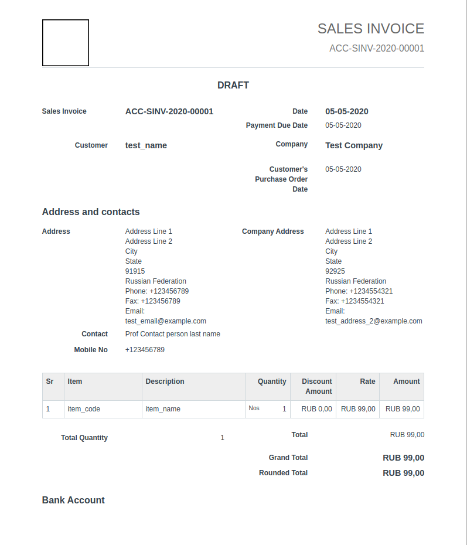
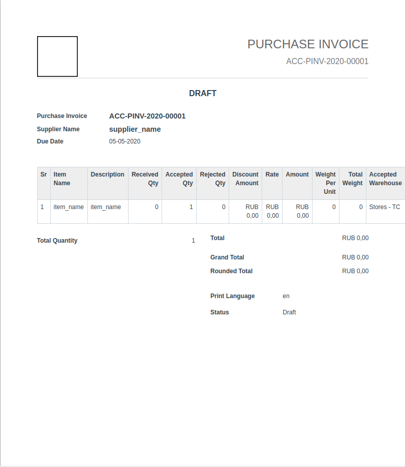

# **recod_erpnext_design** Documentation site

This directory contains the code for the **Recod ERPNext Design** docs site, [monogramm.github.io/recod_erpnext_design](https://monogramm.github.io/recod_erpnext_design).

# Recod Print Formats

##Recod Sales Invoice

##Recod Purchase Invoice

##Recod Quotation

##Recod Salary Slip

##Recod Dark Theme

##Recod Dark Theme

## Contributing

For information about contributing, see the [Contributing page](https://github.com/Monogramm/recod_erpnext_design/blob/master/CONTRIBUTING.md).
