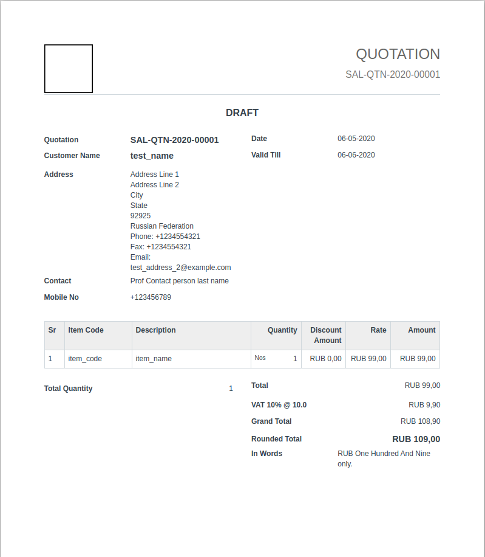
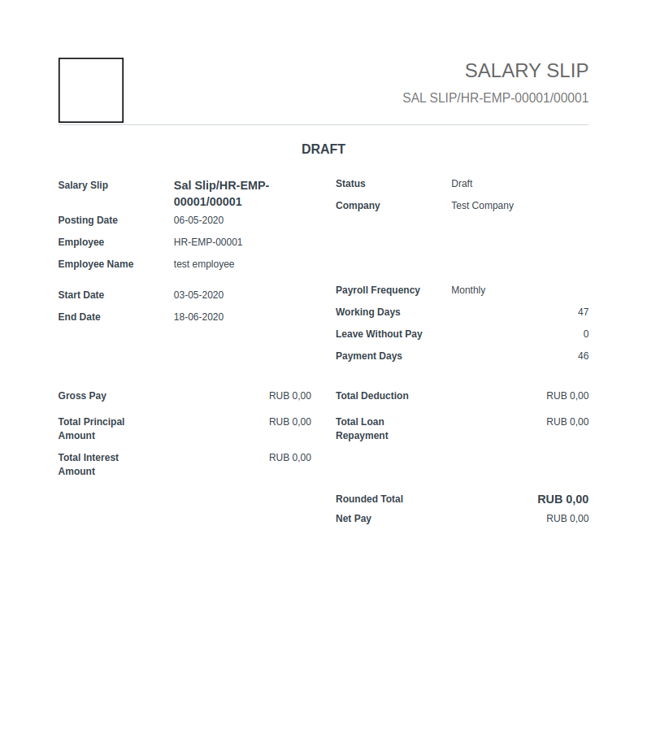

# **Recod ERPNext Design** User Guide

This is the User Guide for **Recod ERPNext Design**.

## Summary

**TODO**

## Recod Print Formats

### Recod Sales Invoice

### Recod Purchase Invoice

### Recod Quotation

### Recod Salary Slip

## Recod Website

### Recod Dark Theme

### Recod Light Theme

## License

Copyright © 2020 [Monogramm](https://github.com/Monogramm). 
This project is [AGPL v3](https://opensource.org/licenses/AGPL-3.0) licensed.
